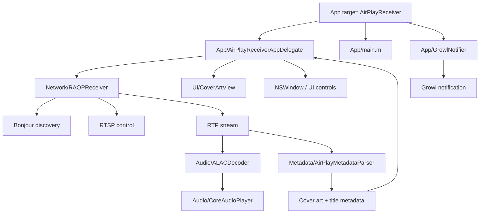

# Tiger Xcode Setup Checklist

## Architecture diagram

## Xcode project checklist

### 1. Create the Cocoa app target
- Create a new Cocoa Application project in Xcode.
- Set the product name to `AirPlayReceiver`.
- Use a bundle identifier such as `com.example.AirPlayReceiver`.
- Set the main nib to `MainMenu`.

### 2. Configure legacy target settings
- Deployment target: 10.4
- Architectures: `ppc` and `i386`
- Build with older Apple GCC or a compatible Tiger-era toolchain
- Use Objective-C with ARC disabled
- Set `GCC_ENABLE_OBJC_ARC` to `NO`

### 3. Add required frameworks
- Cocoa
- CoreAudio
- AudioToolbox
- Optional: Growl

### 4. Add source files
- App/
  - `AirPlayReceiverAppDelegate.m` / `.h`
  - `main.m`
  - `GrowlNotifier.m` / `.h`
- Audio/
  - `ALACDecoder.m` / `.h`
  - `CoreAudioPlayer.m` / `.h`
- Network/
  - `RAOPReceiver.m` / `.h`
- Metadata/
  - `AirPlayMetadataParser.m` / `.h`
- UI/
  - `CoverArtView.m` / `.h`

### 5. Add project resources
- `Project/Info.plist`
- `Project/MainMenu.xib`
- any artwork or localized strings if used later

### 6. Validate compiler settings
- Use legacy Foundation/AppKit headers.
- Ensure no modern ARC syntax is introduced.
- Avoid newer API names that were added after Tiger.
- Check for deprecated API warnings if building against a modern SDK.

### 7. Optional Growl configuration
- Add the Growl framework to the target.
- Define `AIRPLAY_GROWL_AVAILABLE=1` when building with notifications enabled.
- Keep the code guarded so the app still builds without Growl installed.

### 8. Build and sanity checks
- Compile with syntax validation first.
- Verify the app starts and opens the main window.
- Confirm the app can parse the project structure and the UI loads.
- Test the protocol boundary classes independently before attempting live network playback.

## Notes

This is a Tiger-era compatibility setup, not a host of a modern AirPlay stack. It is meant to preserve the correct architecture and build assumptions for an older Mac target while keeping the code modular and extensible.
