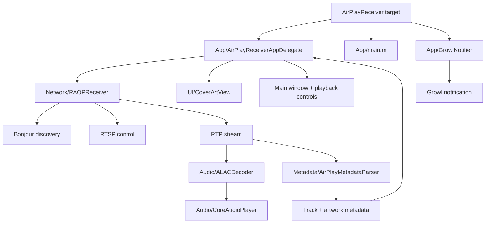

# AirPlay Receiver for Tiger

This project is a Tiger-era AirPlay receiver skeleton intended to run on both PowerPC and Intel Macs. It is designed as a realistic protocol-oriented foundation for a classic AirPlay audio receiver rather than a finished turnkey application.

## Important caveat

- Mac OS X 10.4 Tiger does not expose a public AirPlay receiver API.
- A real implementation must use the RAOP/AirTunes protocol stack: Bonjour discovery, RTSP control, RTP audio, AES session setup, and CoreAudio playback.
- This repository therefore provides a practical app shell and protocol skeleton rather than a drop-in product.

## Current project layout

The source code is organized into logical folders:

- App/ — application delegate, main entry point, and Growl integration
- Audio/ — ALAC decoder and CoreAudio output layer
- Network/ — RAOP/RTSP/RTP receiver logic
- Metadata/ — track and artwork metadata parsing
- UI/ — Cocoa UI and cover-art view
- Resources/ — project resources, assets, and nib-related files
- Build/ — generated or helper build artifacts
- Project/ — Tiger project metadata and compatibility notes

## Architectural flow

The app is structured around:

- Bonjour discovery of AirPlay sources
- RTSP session control for play/pause/next/previous/volume
- RTP audio stream handling
- ALAC decode boundary and PCM generation
- CoreAudio playback on the local Mac
- Cover art display from embedded metadata
- Growl notifications for track changes

## Growl support

The app includes a lightweight Growl notifier that posts a notification when the currently playing track changes.

To enable it in a Tiger build:

- add the Growl framework to the project
- compile with `-DAIRPLAY_GROWL_AVAILABLE=1`
- ensure the runtime has Growl installed

When the flag is off, the code compiles as a no-op and does not require Growl at runtime.

## Build target

This code was written with Tiger-era Cocoa compatibility in mind:

- Objective-C and Cocoa
- PowerPC and Intel ABI-safe code
- Foundation/AppKit and CoreAudio
- non-ARC style coding for legacy compatibility

## Xcode setup overview

## Xcode setup checklist

1. Create a Cocoa Application target named `AirPlayReceiver`.
2. Set the deployment target to `10.4`.
3. Configure architectures for `ppc` and `i386`.
4. Build with an older GCC or Tiger-era toolchain.
5. Disable ARC: `GCC_ENABLE_OBJC_ARC = NO`.
6. Add the frameworks: `Cocoa`, `CoreAudio`, `AudioToolbox`, and optionally `Growl`.
7. Import source files into groups matching the project layout:
   - App/
   - Audio/
   - Network/
   - Metadata/
   - UI/
8. Add the application plist and nib resource files from the project folder.
9. Keep all compiler and framework usage compatible with Tiger-era APIs.
10. Validate with a syntax-only build before live protocol testing.

## Required pieces for a real implementation

1. Bonjour service discovery (`_raop._tcp`)
2. RTSP negotiation over port 5000
3. AES key exchange and session setup
4. RTP packet streaming and reassembly
5. ALAC decoding into PCM
6. AudioQueue/CoreAudio playback
7. Artwork extraction from metadata tags

## Main implementation classes

The primary classes are:

- `App/AirPlayReceiverAppDelegate`
- `Network/RAOPReceiver`
- `UI/CoverArtView`
- `Audio/ALACDecoder`
- `Metadata/AirPlayMetadataParser`
- `Audio/CoreAudioPlayer`
- `App/GrowlNotifier`

These are designed to be extended into a full Tiger-compatible receiver.

## Notes

A complete implementation is a substantial engineering effort, but the folder structure and protocol boundaries in this project provide a clean foundation for a Tiger-compatible AirPlay receiver architecture.
