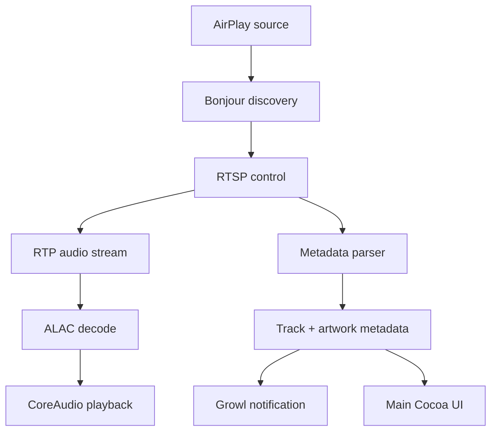

# PowerPlay

> This project was vibecoded with the help of Copilot.

[](https://github.com/pk2061/PowerPlay)
[](https://github.com/pk2061/PowerPlay)
[](https://github.com/pk2061/PowerPlay)

PowerPlay is a classic Cocoa/Objective-C AirPlay receiver prototype built around the constraints of Mac OS X 10.4 Tiger. The goal is to explore a realistic legacy receiver architecture that can discover AirPlay sources, negotiate RTSP control, handle RTP audio transport, parse metadata, and output audio through CoreAudio.

This project is intentionally a protocol-oriented foundation and research scaffold rather than a turnkey streaming product. It aims to stay faithful to Tiger-era runtime and ABI constraints while modeling the key protocol boundaries required for real AirPlay compatibility.

## Why this project exists

- Mac OS X Tiger does not ship with a public AirPlay receiver API.
- A real implementation needs the RAOP/AirTunes protocol stack: Bonjour discovery, RTSP negotiation, RTP audio, session setup, metadata parsing, and audio playback.
- This repository documents and implements the architecture in a way that is easier to reason about, extend, and validate on legacy systems.

## Current status

PowerPlay is in an experimental state. The repository includes:

- a Cocoa app shell for a legacy Mac app
- AirPlay discovery and control flow scaffolding
- RTP and metadata parsing boundaries
- ALAC decoder and CoreAudio playback stubs
- cover-art and track metadata handling
- Growl notifications for track changes

The code is designed as a realistic foundation for further implementation rather than a final consumer-ready application.

## Project layout

- App/ — app lifecycle, UI wiring, and Growl integration
- Audio/ — ALAC decoder and CoreAudio output path
- Network/ — RAOP/RTSP/RTP receiver logic
- Metadata/ — track and cover-art metadata parsing
- UI/ — Cocoa UI and cover-art view
- Resources/ — app resources and localization
- Project/ — Tiger-era Xcode metadata and project setup notes

## Architectural flow



## Features

- Legacy Cocoa app skeleton for Tiger
- RTSP/RTP session negotiation modeling
- ALAC decode boundary and PCM generation path
- CoreAudio playback sink
- Metadata parsing for title, artist, album, and artwork
- Growl notifications on track changes
- Project structure aligned with a classic Xcode Tiger workflow

## Build and validation

This project is set up with a Tiger-oriented syntax validation flow. A lightweight build helper is available at [Project/build.sh](Project/build.sh).

```bash
cd /Users/jan/airplay_tiger_receiver
./Project/build.sh
```

The script is intended for local syntax validation and compatibility checks in a legacy Objective-C/Cocoa build environment.

## GitHub release checklist

See [RELEASE_CHECKLIST.md](RELEASE_CHECKLIST.md) for the release checklist used to validate the app before shipping prototypes or tagged builds.

## Notes

This repository is a practical starting point for a Tiger-era AirPlay receiver, not a complete drop-in implementation. It is best viewed as a protocol-first engineering prototype and architecture reference.
